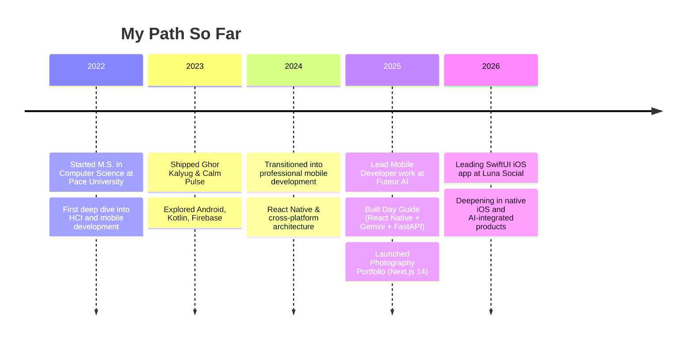

<!-- Animated header -->

 

  
  
  
  

---

## About Me

I build mobile-first products end-to-end — from native iOS in SwiftUI to cross-platform React Native apps, Next.js web experiences, and AI-powered backends. I like problems where design, performance, and product thinking intersect.

- Currently leading native SwiftUI development at **Luna Social**
- M.S. Computer Science — **Pace University** (HCI & Mobile Application Development focus)
- Exploring **on-device ML**, **LLM-driven UX**, and the craft of **thoughtful mobile design**
- Offline interests: guitar, film photography, and long-form writing

---

## Journey

---

## Featured Projects

<table>
<tr>
<td width="50%" valign="top">

### Day Guide
*AI-powered daily planning, built cross-platform*

A natural-language productivity app that turns how you talk into how you plan.

**Stack:** React Native · Expo · Gemini API · FastAPI · Supabase · Google Cloud

`#mobile` `#ai` `#full-stack`

</td>
<td width="50%" valign="top">

### Photography Portfolio
*A personal site that feels like a gallery, not a résumé*

Weekend-built site showcasing film and digital photography with motion-led design.

**Stack:** Next.js 14 · React 18 · TailwindCSS · Framer Motion

`#web` `#design` `#motion`

</td>
</tr>
<tr>
<td width="50%" valign="top">

### Luna Social *(iOS)*
*Leading a native SwiftUI social experience*

End-to-end ownership of a native iOS app — architecture, UI, performance.

**Stack:** Swift · SwiftUI · Combine · Xcode

`#ios` `#swiftui` `#native`

</td>
<td width="50%" valign="top">

### Calm Pulse
*Endel-inspired anxiety companion on Android*

Adaptive soundscapes and breathing exercises tuned to your day.

**Stack:** Kotlin · Android · Jetpack · Firebase

`#android` `#wellness` `#audio`

</td>
</tr>
</table>

---

## Tech I Reach For

**Mobile**

  
  
  
  
  

**Web & Full-Stack**

  
  
  
  
  
  

**AI & Backend**

  
  
  
  
  
  

**Tools & Workflow**

  
  
  
  
  

---

## GitHub Snapshot

 

  

---

## Currently

<table>
<tr>
<td>

- **Building** — a native SwiftUI iOS experience at Luna Social
- **Learning** — advanced Swift concurrency, on-device ML with Core ML
- **Open to** — mobile / full-stack roles in NYC
- **Best way to reach me** — [shivvyas0209@gmail.com](mailto:shivvyas0209@gmail.com)

</td>
</tr>
</table>

---

## Let's Connect

  Built with care in New York. Always learning, always shipping.

