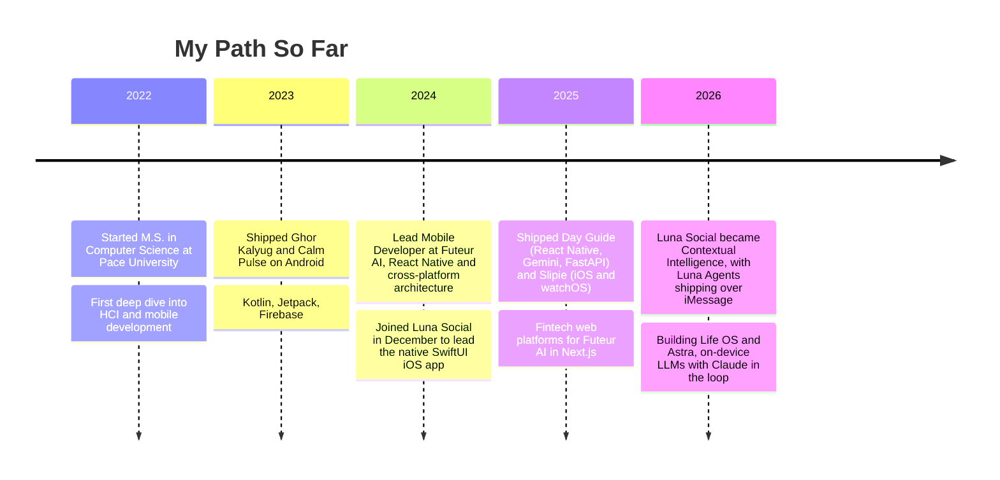

 

  
  
  
  

---

## About Me

I build mobile products end to end: native iOS in Swift and SwiftUI, cross-platform apps in React Native, web in Next.js, and the AI backends behind them. Lately most of my work runs a language model somewhere in the loop, on the device where it can and in the cloud where it must.

- Leading native iOS at **Contextual Intelligence** (formerly Luna Social), a social app with an iMessage agent behind it
- M.S. Computer Science, **Pace University**, with a focus on HCI and mobile development
- Building **Life OS**, a personal health app that reasons over Apple Watch, Whoop and Renpho data on device
- Off the clock: guitar, film photography, long-form writing

---

## Featured Projects

<table>
<tr>
<td width="50%" valign="top">

### Life OS
*One app for every signal you already wear and carry*

Pulls Apple Watch, iPhone, Whoop and Renpho data into a single daily picture, then uses Apple's on-device Foundation Models to say what is working and what is not. Local-first with a Supabase sync layer and a cloud coach for the questions the phone cannot answer alone.

**Stack:** Swift 6 · SwiftUI · Foundation Models · HealthKit · AVAudioEngine · Supabase · Cloud Run · Claude API

`#ios` `#on-device-ml` `#health` `#private`

</td>
<td width="50%" valign="top">

### Astra
*Vedic astrology readings with the math done by code, not the model*

A Next.js API and a native Swift client. Dosha and transit detection is deterministic; Claude only writes the reading. Twice-daily readings arrive over APNs on the user's own clock, prompts are split for cache reuse, and follow-up questions are generated on device by Apple Intelligence so a reading never leaves the phone.

**Stack:** Next.js · TypeScript · Swift · SwiftUI · Claude API · Supabase · APNs · Sign in with Apple

`#ios` `#full-stack` `#llm` `#private`

</td>
</tr>
<tr>
<td width="50%" valign="top">

### [Slipie](https://github.com/shivvyas2/Sleepie)
*Sleep tracking with adaptive soundscapes, iPhone and Apple Watch*

Real-time audio built on an AVAudioEngine node graph with synthesized PCM, running in the background through the night. Watch biometrics arrive over WatchConnectivity, a sleep-stage classifier turns them into stages, and sessions sync to Supabase.

**Stack:** Swift · SwiftUI · watchOS · AVAudioEngine · HealthKit · WatchConnectivity · Supabase

`#ios` `#watchos` `#audio`

</td>
<td width="50%" valign="top">

### [WhyKnot](https://github.com/shivvyas2/WHYKNOT)
*Where should a restaurant open next? Ask the order data.*

Hackathon build on Knot's Transaction Link. Diners connect DoorDash and Uber Eats for rewards; operators see a demand heatmap of what people already order in areas nobody serves. [Live demo](https://whyknot.vercel.app) · [Walkthrough](https://www.youtube.com/watch?v=k9Om6UzmQh0)

**Stack:** Next.js · TypeScript · Knot API · Supabase · Vercel

`#web` `#fintech` `#hackathon`

</td>
</tr>
<tr>
<td width="50%" valign="top">

### Contextual Intelligence *(iOS)*
*Leading the native SwiftUI app at work*

End-to-end ownership of a production social app: architecture, media playback and caching, Combine pipelines, UIKit bridging where SwiftUI runs out, and performance work across a 500-file codebase with a 15-person history.

**Stack:** Swift · SwiftUI · Combine · AVFoundation · Firebase

`#ios` `#swiftui` `#work`

</td>
<td width="50%" valign="top">

### Luna Agents
*An agent that lives in iMessage*

Backend for Clo, the Contextual Intelligence assistant. iMessage webhooks flow through deterministic handlers for consent and RSVPs, then into a LangGraph agent with tools for reservations, events, people matching and rides. Background workers handle proactive outreach and profile embeddings.

**Stack:** Python · FastAPI · LangGraph · Gemini · Redis · Firestore · Composio

`#agents` `#backend` `#work`

</td>
</tr>
</table>

  Earlier work: <a href="https://github.com/shivvyas2/Inhale-Breathing-App">Inhale</a> (guided breathing, React Native) · Day Guide (calendar and email through a Gemini chat, React Native) · <a href="https://github.com/shivvyas2/ExpenseTracker--iOS">Expense Tracker</a> (SwiftUI) · <a href="https://github.com/shivvyas2/SATistics">SATistics</a> (arcade-style SAT practice) · <a href="https://github.com/shivvyas2/shivvyas.com">shivvyas.com</a> (Next.js and Three.js)

---

## Journey

```mermaid
timeline
    title My Path So Far
    2022 : Started M.S. in Computer Science at Pace University
         : First deep dive into HCI and mobile development
    2023 : Shipped Ghor Kalyug and Calm Pulse on Android
         : Kotlin, Jetpack, Firebase
    2024 : Lead Mobile Developer at Futeur AI, React Native and cross-platform architecture
         : Joined Luna Social in December to lead the native SwiftUI iOS app
    2025 : Shipped Day Guide (React Native, Gemini, FastAPI) and Slipie (iOS and watchOS)
         : Fintech web platforms for Futeur AI in Next.js
    2026 : Luna Social became Contextual Intelligence, with Luna Agents shipping over iMessage
         : Building Life OS and Astra, on-device LLMs with Claude in the loop
```

---

## Tech I Reach For

**Mobile**

  
  
  
  
  

**Web**

  
  
  
  

**AI & Backend**

  
  
  
  
  
  
  
  

---

## GitHub Snapshot

---

## Currently

<table>
<tr>
<td>

- **Building** Life OS and Astra, two apps where the model runs on the phone whenever it can
- **Shipping** the Contextual Intelligence iOS app and the iMessage agent behind it
- **Learning** Swift 6 strict concurrency, Foundation Models, and how to keep LLM features cheap enough to ship an app for free
- **Open to** iOS and full-stack roles in NYC
- **Reach me** at [shivvyas0209@gmail.com](mailto:shivvyas0209@gmail.com)

</td>
</tr>
</table>

---

## Let's Connect

  Built with care in New York. Always learning, always shipping.

